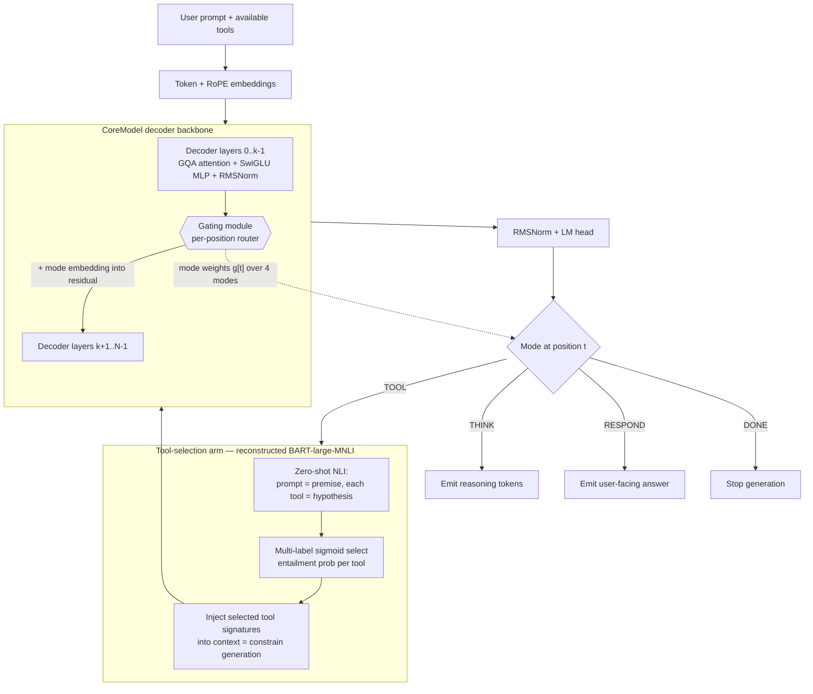
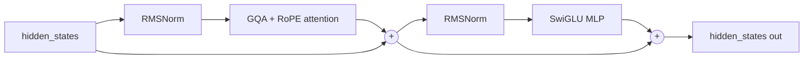
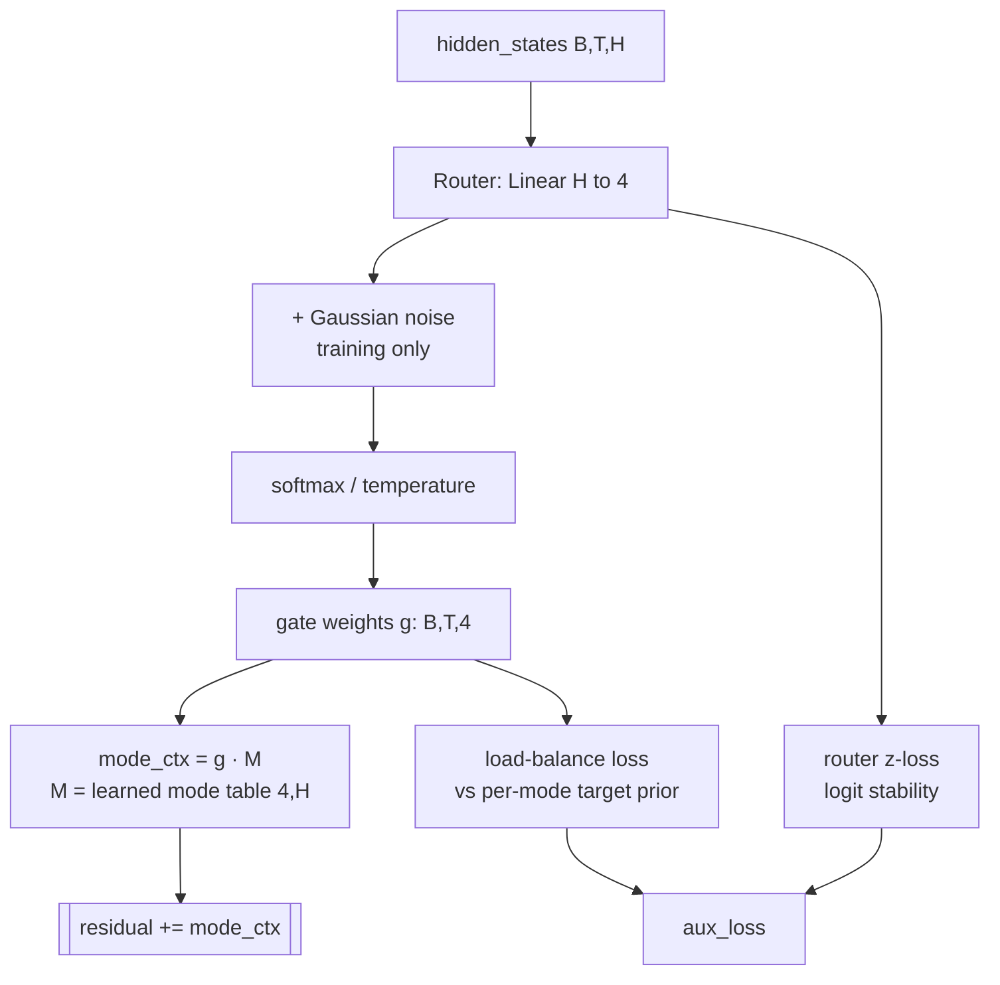
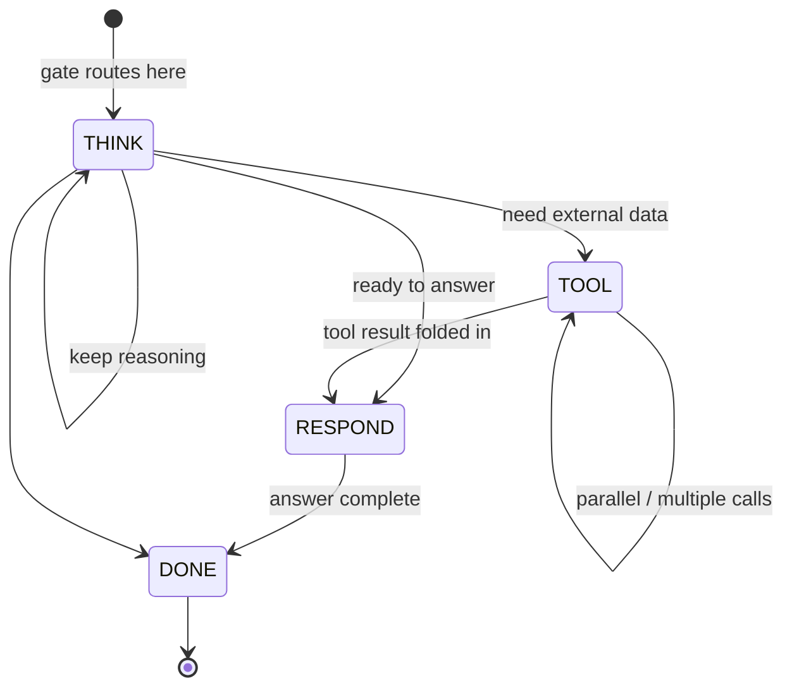
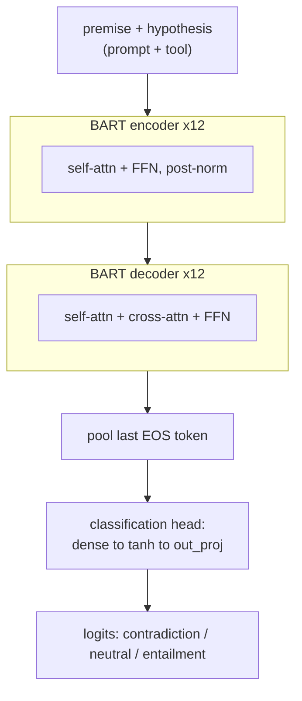
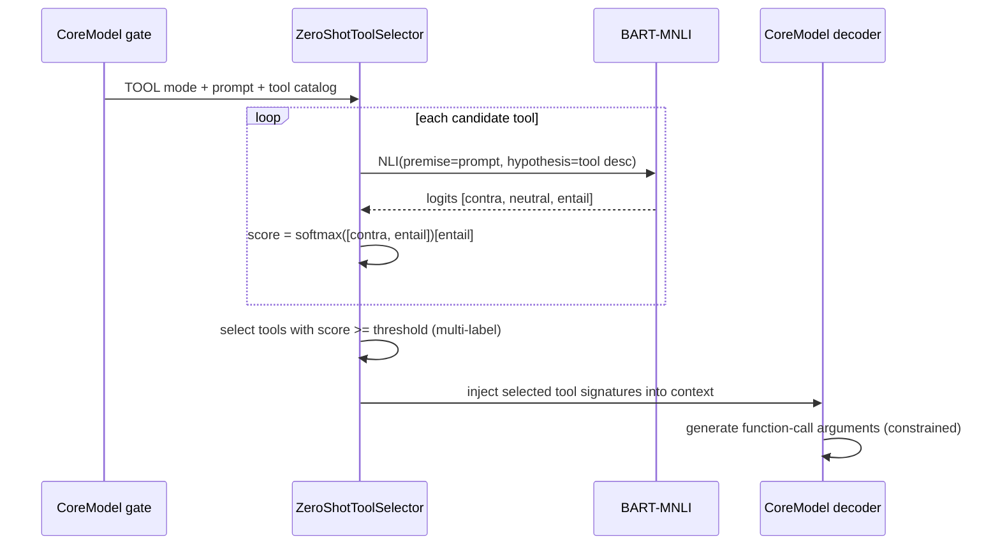
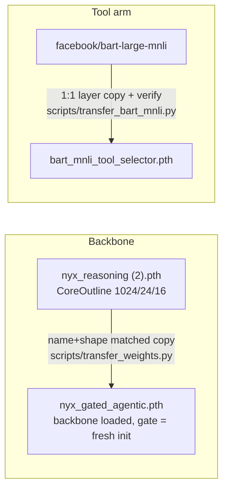
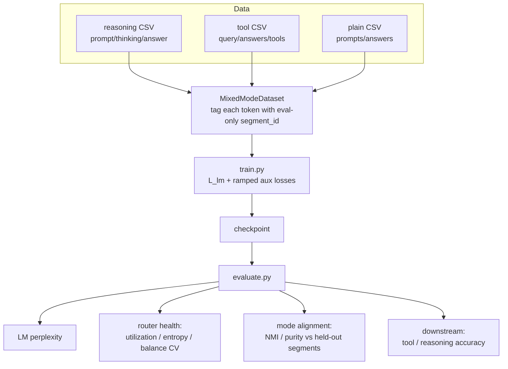

# Nyx Gated Agentic Model — Architecture

This document describes the **entire** model: a decoder-only language model
(`CoreModel`) augmented with a **per-position latent gate** that routes each
token between four behavioral modes — **THINK, TOOL, RESPOND, DONE** — and a
dedicated **zero-shot tool-selection arm** built on a from-scratch
reconstruction of `facebook/bart-large-mnli`.

The model is warm-started from the pretrained `nyx_reasoning` checkpoint (so it
is not trained from scratch) and saved as `nyx_gated_agentic.pth`.

---

## 1. Overview



The model has three conceptual pieces, each documented below:

| Segment | Where | Role |
|---|---|---|
| **CoreModel backbone** | [src/models/core_model.py](../../src/models/core_model.py) | Decoder-only transformer that produces hidden states and next-token logits |
| **Gating mechanism** | [src/core/gating.py](../../src/core/gating.py) | Per-position router that picks the mode and injects it into the residual stream |
| **Tool-selection arm** | [src/models/bart_mnli.py](../../src/models/bart_mnli.py) + [src/models/tool_selection.py](../../src/models/tool_selection.py) | Zero-shot classifier that decides *which* tools to call when the gate says TOOL |

---

## 2. CoreModel backbone

A Qwen-style decoder-only transformer. Each layer is a standard pre-norm block
reused from the tested `CoreOutlineDecoderLayer`:

- **RoPE** rotary position embeddings
- **GQA** grouped-query attention (`num_key_value_heads ≤ num_attention_heads`)
- **SwiGLU** MLP (`down(silu(gate(x)) * up(x))`)
- **RMSNorm** normalization



**Architecture (matches the pretrained `nyx_reasoning` backbone):**

| Field | Value |
|---|---|
| `hidden_size` | 1024 |
| `num_hidden_layers` | 24 |
| `num_attention_heads` / `num_key_value_heads` | 16 / 16 |
| `intermediate_size` | 2816 |
| `vocab_size` | 151936 |
| `max_position_embeddings` | 32768 |

Classes: `GatedCoreModel` (backbone), `CoreModelForCausalLM` (LM head + losses),
`CoreModelConfig` (extends `CoreOutlineConfig` with gating fields).

---

## 3. Gating mechanism

The gate is a **per-position latent router**. It is *latent* because it is
trained with **no mode labels** — it learns to partition its own computation
from the language-modeling loss plus load-balancing auxiliary losses (MoE-style,
after *Switch Transformer* and *ST-MoE*).

### Modes

| Id | Mode | Meaning |
|---|---|---|
| 0 | `THINK` | internal reasoning / chain-of-thought |
| 1 | `TOOL` | emit a tool / function call (triggers the tool arm) |
| 2 | `RESPOND` | produce the user-facing answer |
| 3 | `DONE` | turn complete — a learned, mode-level stop signal |

### Data flow inside the gate



- **Mode conditioning:** the chosen mode is injected back into the residual
  stream as a learned embedding — a soft mixture `g @ M` (optionally hardened
  with a straight-through estimator).
- **Load-balancing** uses a **per-mode target prior** `[⅓, ⅓, ⅓, ~0.04]` so
  `DONE` is expected to fire ~once per sequence rather than ~25% of tokens.
- **Placement:** by default a single shared gate sits mid-stack
  (`gate_layer_indices = [num_layers // 2]`), so lower layers gather context to
  decide the mode and upper layers act on the mode-conditioned residual.

### Training objective

```
loss = L_lm  +  router_aux_loss_coef · L_balance  +  router_z_loss_coef · L_z
```

Defaults: `router_aux_loss_coef = 1e-2`, `router_z_loss_coef = 1e-3`,
`gate_noise_std = 0.3`.

### Inference control

`CoreModelForCausalLM.generate` halts when the top gate at the last position is
`DONE` above `done_threshold` (independent of the tokenizer EOS).

---

## 4. The four arms in operation



`THINK`, `RESPOND`, and `DONE` are handled by the shared LM head (the mode
embedding biases which tokens are produced). `TOOL` additionally activates the
tool-selection arm described next.

---

## 5. Tool-selection arm (reconstructed BART-large-MNLI)

When the gate routes to `TOOL`, the model must decide **which** tools to call.
This is done exactly like `bart-large-mnli` zero-shot classification: the prompt
is the NLI **premise**, each candidate tool is a **hypothesis**
(`"This request requires a tool that can {description}."`), and the **entailment
probability** is the tool's relevance score.

### 5.1 Reconstructed BART-MNLI

`facebook/bart-large-mnli` is reconstructed from scratch in PyTorch
([src/models/bart_mnli.py](../../src/models/bart_mnli.py)) — an encoder–decoder
transformer with an EOS-pooled 3-way classification head
(`contradiction / neutral / entailment`).



**Config:** d_model 1024, 12 encoder + 12 decoder layers, 16 heads, ffn 4096,
gelu, tied embeddings, learned positions (offset 2), vocab 50265.

Weights are transferred **1:1** from the HF checkpoint and **numerically
verified** (see §6): 517/517 tensors, max logit diff ≈ 1e-6.

### 5.2 Selection + constraint



- **Multi-label:** each tool gets an independent 0..1 entailment probability;
  any tool above `threshold` is selected (falls back to top-1 if none clear it).
- **Constrain generation:** the selected tools' signatures are rendered into the
  context (`### Function Calls:` block) before the CoreModel emits arguments.

Entry points: `load_tool_selector(...)`, `ZeroShotToolSelector.score/select`,
and `run_tool_arm(core_model, tokenizer, prompt, tools, selector)`
([src/models/tool_selection.py](../../src/models/tool_selection.py)).

---

## 6. Weight provenance (no training from scratch)



- **Backbone transfer** — [scripts/transfer_weights.py](../../scripts/transfer_weights.py):
  the gated model reuses `CoreOutlineDecoderLayer`, so its keys are a *superset*
  of `nyx_reasoning`. Every attention/MLP/norm/embedding/lm_head tensor loads;
  only the small `model.gates.*` parameters start fresh. Loaded with
  `strict=False`.
- **Tool-arm transfer** — [scripts/transfer_bart_mnli.py](../../scripts/transfer_bart_mnli.py):
  copies all 517 tensors and asserts reconstructed logits match HF
  (max abs diff ≈ 9.5e-07) before saving.

---

## 7. Training & data pipeline

Routing is latent, so training must (a) run stably and (b) prove the discovered
modes are meaningful using segment labels held out for **evaluation only**.



- **Datasets** — [scripts/download_datasets.py](../../scripts/download_datasets.py)
  pulls open HF datasets across finance/accounting, data-analytics (SQL),
  coding, reasoning, and tool-calling, and normalizes them into the three
  schemas above so they train **together**.
- **Aux-loss ramp** lets the LM stabilize before routing pressure is applied,
  avoiding early collapse onto one mode.
- **Mode-alignment** is the key eval: since routing is unsupervised, we compare
  the gate's argmax against held-out segment labels (NMI / purity / confusion
  matrix) to confirm the gate rediscovered think/tool/respond/done on its own.

Details: [experiments/gating/README.md](../../experiments/gating/README.md) and
the design note [docs/plans/2026-07-01-gating-mechanism-design.md](../plans/2026-07-01-gating-mechanism-design.md).

---

## 8. End-to-end inference

```mermaid
sequenceDiagram
    participant U as User
    participant CM as CoreModel (gated)
    participant TA as Tool arm (BART-MNLI)
    participant EX as Tool executor

    U->>CM: prompt + available tools
    loop per generated position
        CM->>CM: decode; gate picks mode g[t]
        alt THINK
            CM->>CM: emit reasoning token
        else TOOL
            CM->>TA: prompt + tool catalog
            TA-->>CM: selected tools + constrained context
            CM->>EX: emit function call(s)
            EX-->>CM: tool result -> context
        else RESPOND
            CM->>U: emit answer token
        else DONE
            CM->>U: stop
        end
    end
```

---

## 9. File map

| Path | Contents |
|---|---|
| [src/core/gating.py](../../src/core/gating.py) | `GatingModule`, `Mode`, aux losses |
| [src/models/core_model.py](../../src/models/core_model.py) | `GatedCoreModel`, `CoreModelForCausalLM`, `CoreModelConfig` |
| [src/models/bart_mnli.py](../../src/models/bart_mnli.py) | Reconstructed BART-large-MNLI |
| [src/models/tool_selection.py](../../src/models/tool_selection.py) | `ZeroShotToolSelector`, `run_tool_arm` |
| [scripts/transfer_weights.py](../../scripts/transfer_weights.py) | nyx_reasoning → nyx_gated_agentic |
| [scripts/transfer_bart_mnli.py](../../scripts/transfer_bart_mnli.py) | bart-large-mnli → tool selector |
| [scripts/download_datasets.py](../../scripts/download_datasets.py) | Build the combined training mixture |
| [experiments/gating/](../../experiments/gating/) | Data, training, metrics, evaluation |

---

## 10. Quick start

```bash
# 1. Warm-start the backbone from nyx_reasoning
python -m scripts.transfer_weights --src "models/nyx_reasoning (2).pth" --dst models/nyx_gated_agentic.pth

# 2. Reconstruct + transfer the tool-selection arm
python -m scripts.transfer_bart_mnli   # -> models/bart_mnli_tool_selector.pth

# 3. Build the combined datasets
python -m scripts.download_datasets --max-per-dataset 5000

# 4. Continue-train the gated model on the mixture
python -m experiments.gating.train --nyx --combined --init-weights models/nyx_gated_agentic.pth

# 5. Evaluate (LM ppl, router health, mode alignment)
python -m experiments.gating.evaluate --checkpoint experiments/gating/checkpoints/core_model.pt
```
